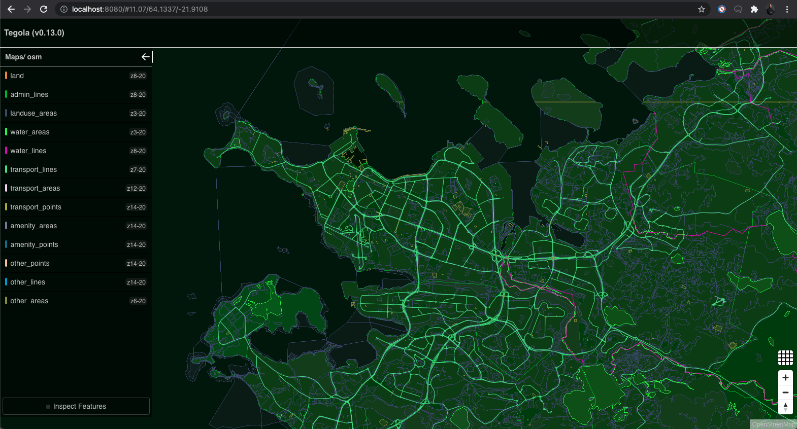
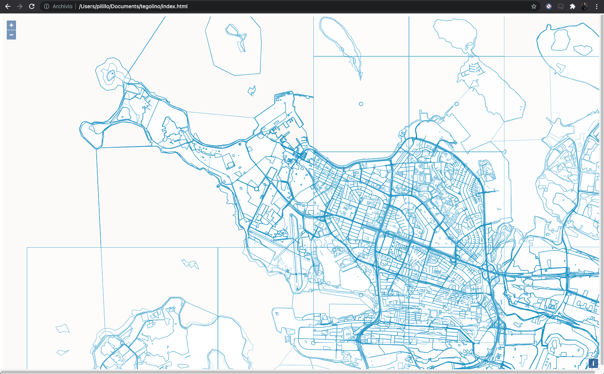
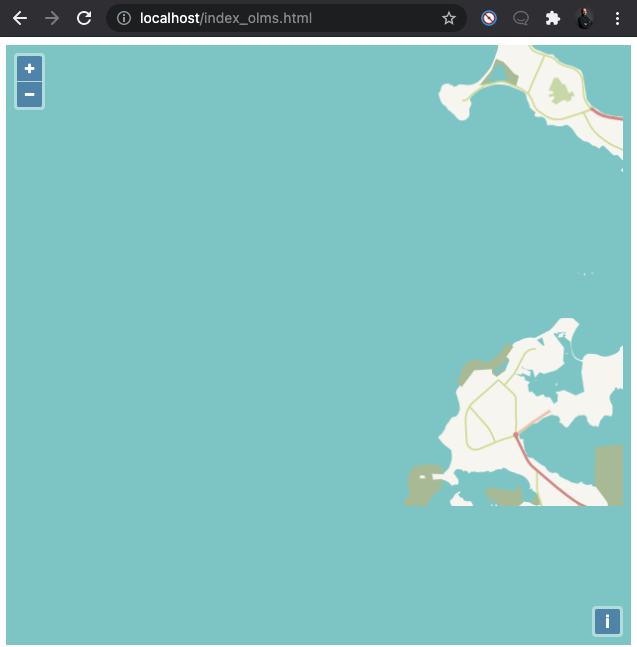

# tegolino
Tegola in a bite

## Start postgis and tegola
`docker-compose up`

## Root UI
Visit `http://localhost:8080` to see the following:



There you go, Reykjavik city centre.

## Custom Web UI
You can start from an example web UI by opening the `index.html` file in a browser or by simply going to the running nginx container, at `http://localhost:80`.



The same map once again, amazing!

You can now work on the map style, either by tuning directly the javascript objects or by loading a Mapbox json style file.
To visually create and export a style, you can use the free [Fresco](https://fresco.go-spatial.org/) tool.

Do not forget to set the source to the Tegola host (in this example running at `localhost:8080`), namely to `http://localhost:8080/capabilities/osm.json` which returns the following information:

```json
{"attribution":"OpenStreetMap","bounds":[-180,-85.0511,180,85.0511],"center":[-21.919048,64.1299534,12],"format":"pbf","minzoom":3,"maxzoom":20,"name":"osm","description":null,"scheme":"xyz","tilejson":"2.1.0","tiles":["http://localhost:8080/maps/osm/{z}/{x}/{y}.pbf"],"grids":[],"data":[],"version":"1.0.0","template":null,"legend":null,"vector_layers":[{"version":2,"extent":4096,"id":"land","name":"land","geometry_type":"polygon","minzoom":8,"maxzoom":20,"tiles":["http://localhost:8080/maps/osm/land/{z}/{x}/{y}.pbf"]},{"version":2,"extent":4096,"id":"admin_lines","name":"admin_lines","geometry_type":"polygon","minzoom":8,"maxzoom":20,"tiles":["http://localhost:8080/maps/osm/admin_lines/{z}/{x}/{y}.pbf"]},{"version":2,"extent":4096,"id":"landuse_areas","name":"landuse_areas","geometry_type":"polygon","minzoom":3,"maxzoom":20,"tiles":["http://localhost:8080/maps/osm/landuse_areas/{z}/{x}/{y}.pbf"]},{"version":2,"extent":4096,"id":"water_areas","name":"water_areas","geometry_type":"unknown","minzoom":3,"maxzoom":20,"tiles":["http://localhost:8080/maps/osm/water_areas/{z}/{x}/{y}.pbf"]},{"version":2,"extent":4096,"id":"water_lines","name":"water_lines","geometry_type":"line","minzoom":8,"maxzoom":20,"tiles":["http://localhost:8080/maps/osm/water_lines/{z}/{x}/{y}.pbf"]},{"version":2,"extent":4096,"id":"transport_lines","name":"transport_lines","geometry_type":"line","minzoom":7,"maxzoom":20,"tiles":["http://localhost:8080/maps/osm/transport_lines/{z}/{x}/{y}.pbf"]},{"version":2,"extent":4096,"id":"transport_areas","name":"transport_areas","geometry_type":"polygon","minzoom":12,"maxzoom":20,"tiles":["http://localhost:8080/maps/osm/transport_areas/{z}/{x}/{y}.pbf"]},{"version":2,"extent":4096,"id":"transport_points","name":"transport_points","geometry_type":"point","minzoom":14,"maxzoom":20,"tiles":["http://localhost:8080/maps/osm/transport_points/{z}/{x}/{y}.pbf"]},{"version":2,"extent":4096,"id":"amenity_areas","name":"amenity_areas","geometry_type":"polygon","minzoom":14,"maxzoom":20,"tiles":["http://localhost:8080/maps/osm/amenity_areas/{z}/{x}/{y}.pbf"]},{"version":2,"extent":4096,"id":"amenity_points","name":"amenity_points","geometry_type":"point","minzoom":14,"maxzoom":20,"tiles":["http://localhost:8080/maps/osm/amenity_points/{z}/{x}/{y}.pbf"]},{"version":2,"extent":4096,"id":"other_points","name":"other_points","geometry_type":"point","minzoom":14,"maxzoom":20,"tiles":["http://localhost:8080/maps/osm/other_points/{z}/{x}/{y}.pbf"]},{"version":2,"extent":4096,"id":"other_lines","name":"other_lines","geometry_type":"line","minzoom":14,"maxzoom":20,"tiles":["http://localhost:8080/maps/osm/other_lines/{z}/{x}/{y}.pbf"]},{"version":2,"extent":4096,"id":"other_areas","name":"other_areas","geometry_type":"polygon","minzoom":6,"maxzoom":20,"tiles":["http://localhost:8080/maps/osm/other_areas/{z}/{x}/{y}.pbf"]}]}
```

Now you can have a look at `http://localhost/index_olms.html` which imports the style file.
Slowly loading the map of Southwest Iceland. Yeeey!



## Resources
* https://github.com/go-spatial/tegola
* https://github.com/go-spatial/tegola-osm
* https://tegola.io/documentation/getting-started/
* https://openlayers.org/en/latest/doc/quickstart.html
* https://tegola.io/tutorials/tegola-with-olms/